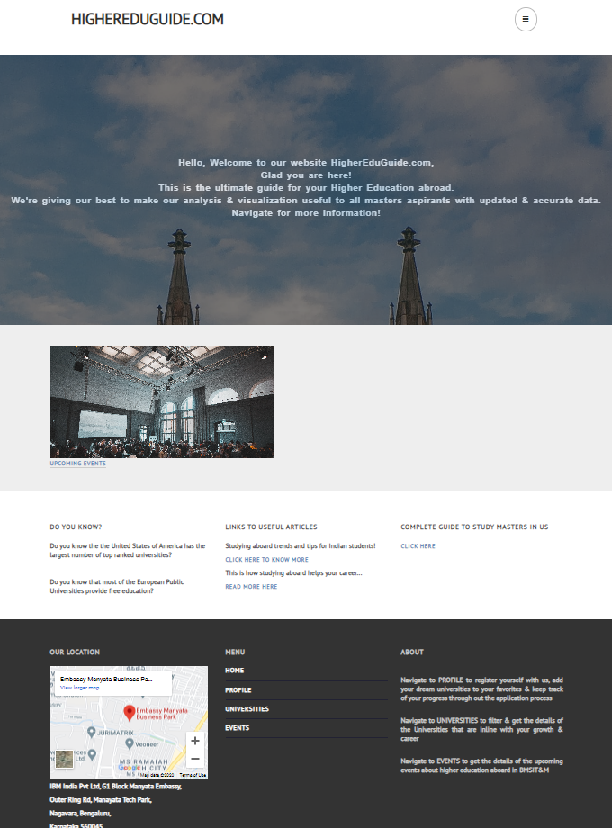

# Higher Education Platform
Online Higher education management platform developed as part of Mini project

As part of Computer Science Engineering coursework, under Visvesvaraya Technological University (VTU), a web application using PHP, Javascript, HTML is developed

Application screen shots:
1. Home page

2. Profile page

3. University search page

4. Course details page

5. Upcomming Events page

Files: 
* map.php - contains code for displaying the map
* map_form.php - contains code to display the form and filter colleges, to display on the map
* college_db.php - connects the college ranks table to the application, to display the colleges
* masters_pgm_db - connects the program details table to the application (to display on the details page)
* sql zip file - contains the database to be imported in phpmyadmin, will be updated
* hep_login, hep_signup, hep_logout - same functionality
* profile_fav.php - NOT DISPLAYED, used internally to add favorites
* profile_fav_delete.php - to delete course in favorites list from profile page
* profile.php - user details page
* hep_home.html - updated home page with links
* db_connect.php - contains the data required to connect to the database. It can be include in any php file, to reduce repeted code

